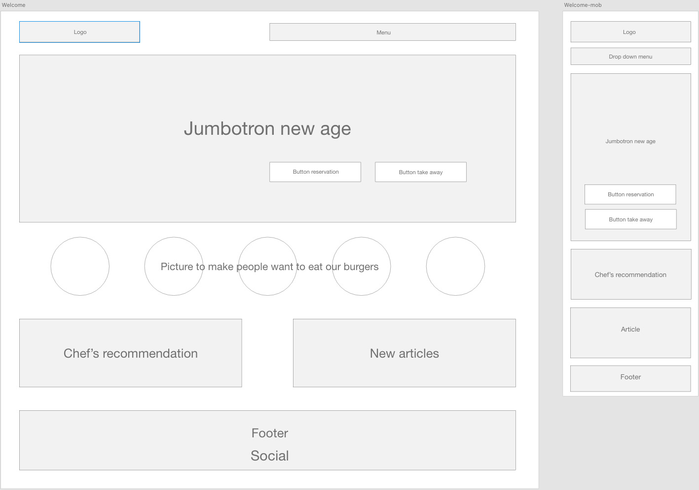
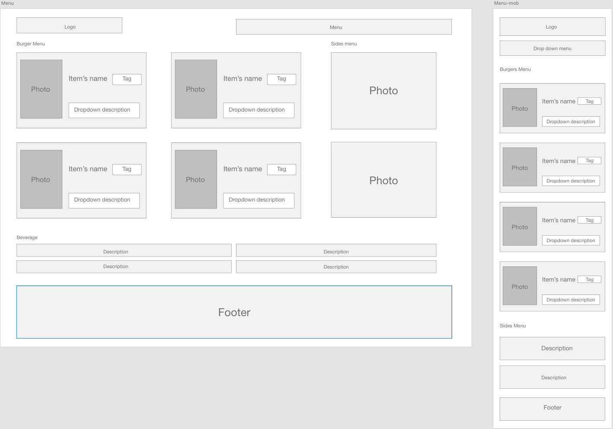
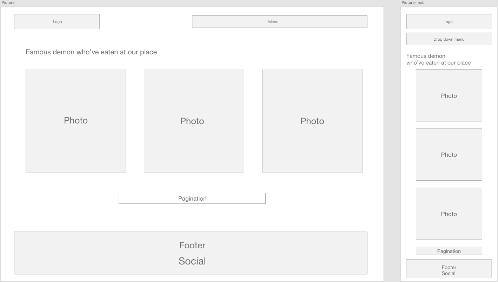
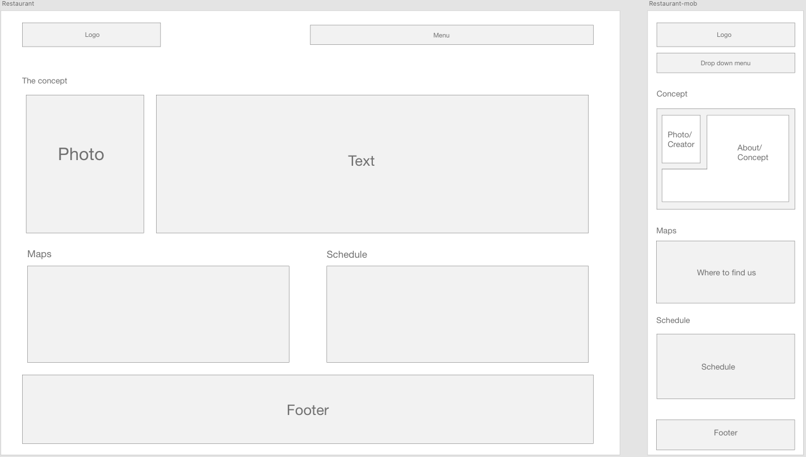
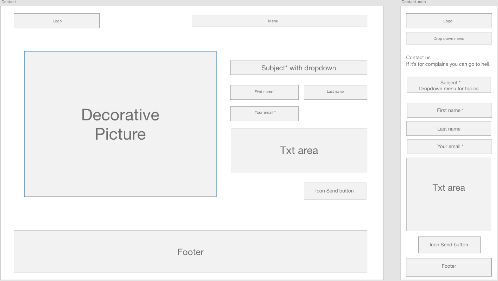

# READ ME

# Restaurant CSS Framework

### Used technologies

- Terminal - Git
- GitHub
- Adobe Xd (mock-ups and design)
- Visual Studio Code (text editor)
- CSS 3
- HTML 5
- Twitter Bootrsrap framework V 5.0

### Mission

The mission is to create a ficitonnal restaurant's website using Bootstrap. The concent is our choice but we have to use Bootstrap for the layout. We had to first, create a mock-ups in order to have a conduct line to create the website. You'll find my mock-ups later in the read me. The methodology was to design mobile-first and then rearranging for the desktop version. On the website there are supposed to be 5 pages : 
- Welcome 
- Menu
- Pictures
- Restaurant
- Contact

All of those pages have to include some particularities for instance welcome need a jumbotron, menu some tags, pictures a pagination,... All the details can be found [here](https://github.com/becodeorg/BXL-Swartz-4-27/blob/master/1.The-Field/6.Bootstrap/restaurant.adoc).

### Objectives

The first objectif of this exercice is to learn more about Twitter Bootstrap and how to use.

### Mock-ups

Disclaimer : What you'll see in the mock-ups is all about positioning elements. It doesn't give you the final look of the product. Box sizes, colors, images,... are not defined yet.

#### Welcome

#### Menu

#### Pictures

#### Restaurant

#### Contact

