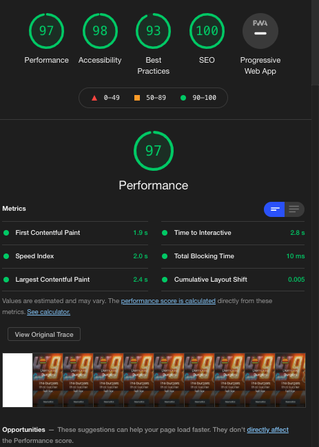
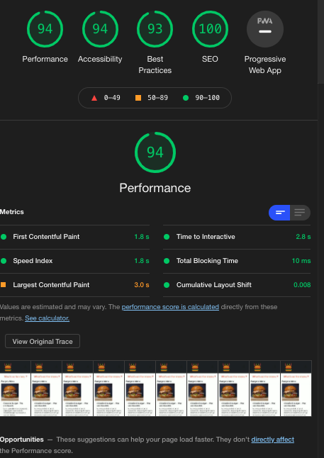
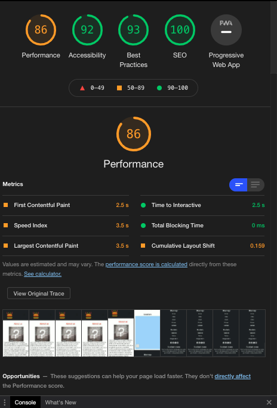
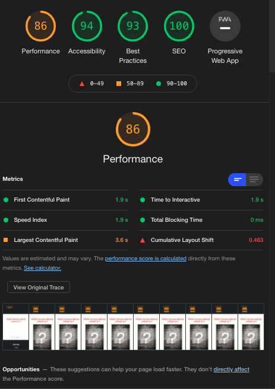
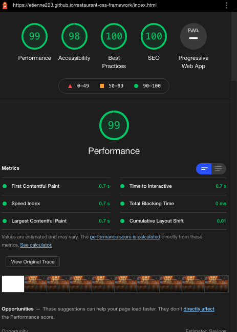
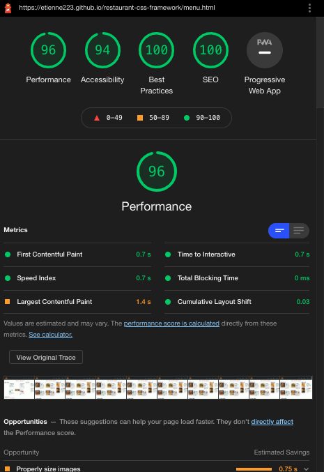
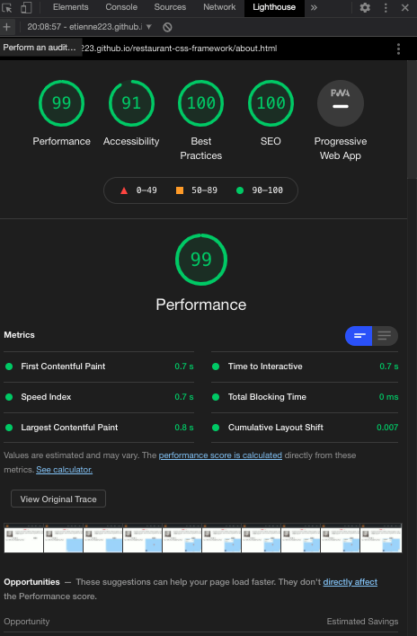
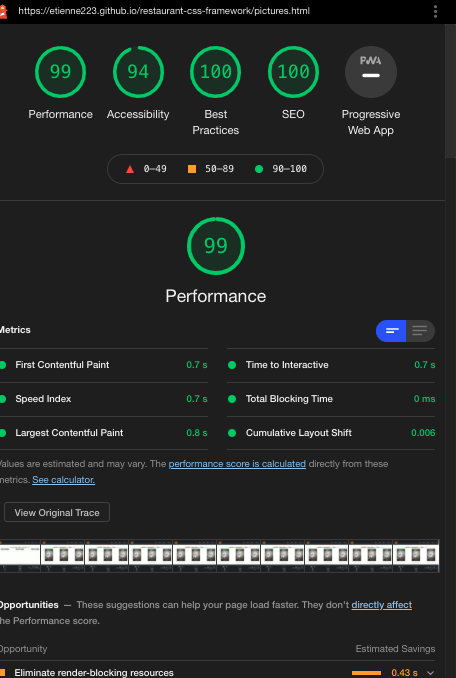
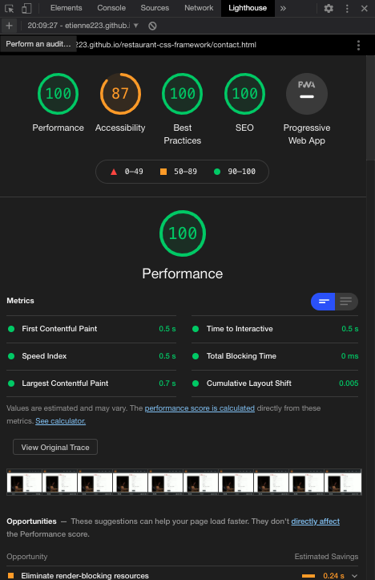

# READ ME

# Restaurant CSS Framework

### Progression

The progression can be seen clicking on this [link](https://etienne223.github.io/restaurant-css-framework/).

### Work Members

Etienne Lefèvre [@Etienne223](https://github.com/Etienne223)

### Used technologies

- Terminal - Git
- GitHub
- Adobe Xd (mock-ups and design)
- Visual Studio Code (text editor)
- CSS 3
- HTML 5
- Twitter Bootrsrap framework V 5.0
- Font Awesome

### Mission

Mission start: 28 /01 /2021.
Mission end: 02/ 02/ 2021.

The mission is to create a ficitonnal restaurant's website using Bootstrap. The concent is our choice but we have to use Bootstrap for the layout. We had to first, create a mock-ups in order to have a conduct line to create the website. You'll find my mock-ups later in the read me. The methodology was to design mobile-first and then rearranging for the desktop version. On the website there are supposed to be 5 pages : 
- Welcome 
- Menu
- Pictures
- Restaurant
- Contact

All of those pages have to include some particularities for instance welcome need a jumbotron, menu some tags, pictures a pagination,... All the details can be found [here](https://github.com/becodeorg/BXL-Swartz-4-27/blob/master/1.The-Field/6.Bootstrap/restaurant.adoc).

### Objectives

The main objectif of this exercice is to learn more about Twitter Bootstrap and how to use.

### Mock-ups

Disclaimer : What you'll see in the mock-ups is all about positioning elements. It doesn't give you the final look of the product. Box sizes, colors, images,... are not defined yet.

#### Welcome

#### Menu

#### Pictures

#### Restaurant

#### Contact

### Photos and illustrations credits :

All the photos used on my fictionnal website where found either on pexels or unsplash :

Shout out to : 
- [Amirali Mirhashemian](https://unsplash.com/photos/Tht2Sdwqey8?utm_source=unsplash&utm_medium=referral&utm_content=creditShareLink) for the good looking burgers.
- [Pedro Marroquin](https://unsplash.com/photos/wOfr3hu7Kok?utm_source=unsplash&utm_medium=referral&utm_content=creditShareLink) for the jumbotron pic'.
- [Vadim Markin ](https://unsplash.com/photos/BFtIlGdWKbk?utm_source=unsplash&utm_medium=referral&utm_content=creditShareLink) for the chef's picture.
- [Matt Walsh](https://unsplash.com/photos/BFtIlGdWKbk?utm_source=unsplash&utm_medium=referral&utm_content=creditShareLink) for the question mark.
- [Abby Kale](https://unsplash.com/photos/ZyhYzS-56JQ?utm_source=unsplash&utm_medium=referral&utm_content=creditShareLink) for the potatoes.
- [Louis Hansel](https://unsplash.com/photos/ZyhYzS-56JQ?utm_source=unsplash&utm_medium=referral&utm_content=creditShareLink) for the nice fries.

Disclaimer : Images quality might have been downgraded for the optimization.

### Lighthouse 

Here are all the details about Lighthouse testing. First we got Lighthouse for the mobile version and then for desktop.

#### Mobile 

##### Home

##### Menu

##### About

##### Pictures

##### Form

#### Desktop 

##### Home

##### Menu

##### About

##### Pictures

##### Form

